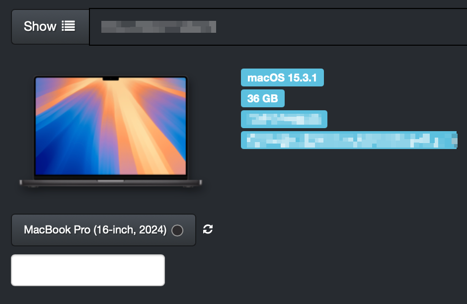

Machine module
==============

The Machine module provides information about the hardware of the Mac, including the model, serial number, and hardware details with links to https:www.everymac.com and <https://www.mactracker.ca>. It also handles device image caching functionality. If the ibridge module is installed, it also displays the device color and relevant device image.



Configuration
-------------

By default the Machine module will NOT cache device images locally. To enable the cache edit .env. The web server should have write access to /public.
Setting `IMAGE_CACHE` to `FALSE` will load images directly from Apple's servers. Setting it to `TRUE` will enable the local cache.

```
IMAGE_CACHE=TRUE
```

Admin Page
----------

The Machine module includes an admin page that allows administrators to manage device image and Mactracker caching settings. The admin page can be accessed through the MunkiReport admin menu.

The Mactracker cache enables direct model lookup in the Mactracker app.

Features available on the admin page include:

* Monitoring cache storage usage
* Clearing the image cache
* Refreshing Mactracker data

To access the admin page, navigate to Admin → Machine in the MunkiReport interface.

Table Schema
-----

* serial_number - VARCHAR(255) - Machine serial number
* hostname - VARCHAR(255) - Machine hostname
* machine_model - VARCHAR(255) - Machine model
* machine_desc - VARCHAR(255) - Machine description
* img_url - VARCHAR(255) - URL of the machine image
* current_processor_speed - VARCHAR(255) - Current processor speed
* cpu_arch - VARCHAR(255) - CPU architecture
* cpu_type - VARCHAR(255) - CPU type
* cpu_physical_cores - INT(11) - Number of physical CPU cores
* cpu_logical_cores - INT(11) - Number of logical CPU cores
* physical_memory - BIGINT(20) - Amount of physical memory
* platform_UUID - VARCHAR(255) - Platform UUID
* number_processors - INT(11) - Number of processors
* SMC_version_system - VARCHAR(255) - SMC version
* boot_rom_version - VARCHAR(255) - Boot ROM version
* bus_speed - VARCHAR(255) - Bus speed
* computer_name - VARCHAR(255) - Computer name
* l2_cache - VARCHAR(255) - L2 cache
* l3_cache - VARCHAR(255) - L3 cache
* machine_name - VARCHAR(255) - Machine name
* packages - INT(11) - Number of packages
